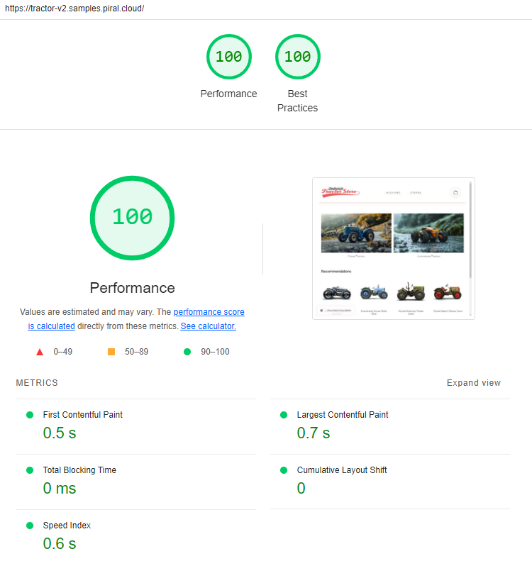

[](https://piral.io)

# [Piral Sample](https://piral.io) &middot; [](https://github.com/smapiot/piral/blob/main/LICENSE) [](https://discord.gg/kKJ2FZmK8t)

> The Tractor v2 Micro Frontends Sample using Piral with a Monorepo

:zap: A mono repository using Piral for micro frontends.

Feel free to play around with the code using StackBlitz.

[](https://stackblitz.com/github/piral-samples/tractor-v2)

A micro frontends sample implementation of [The Tractor Store](https://micro-frontends.org/tractor-store/) built with Piral and React. It's based on the [Blueprint](https://github.com/neuland/tractor-store-blueprint).

**Live Demo:** [tractor-v2.samples.piral.cloud](https://tractor-v2.samples.piral.cloud/)

## About This Implementation

### Technologies

List of techniques used in this implementation.

| Aspect                     | Solution                                  |
| -------------------------- | ----------------------------------------- |
| 🛠️ Frameworks, Libraries   | [React], [Piral], [esbuild]              |
| 📝 Rendering               | SPA                                      |
| 🐚 Application Shell       | Piral                                     |
| 🧩 Client-Side Integration | Piral Extension Components                |
| 🧩 Server-Side Integration | *none* / (could render SSR, too)          |
| 📣 Communication           | Custom Events, Slots                      |
| 🗺️ Navigation              | SPA, One MF per Team, Piral-based routing |
| 🎨 Styling                 | Self-Contained CSS (No Global Styles)     |
| 🍱 Design System           | None                                      |
| 🔮 Discovery               | [Piral.Cloud]                             |
| 🚚 Deployment              | Static Page                               |
| 👩‍💻 Local Development       | [Piral]                                   |

[React]: https://react.dev/
[Piral]: https://www.piral.io/
[esbuild]: https://esbuild.github.io/
[Piral.Cloud]: https://www.piral.cloud/

### Limitations

This implementation is deliberately kept simple to focus on the micro frontends aspects. URLs are hardcoded, components could be more DRY and no linting, testing or type-safety is implemented. In a real-world scenario, these aspects should be addressed properly.

### Performance

Several performance optimizations could still be applied, however, in the out-of-the-box state with three micro frontends and multiple components / pages included we'll end up with a lighthouse score of 100/100, which is great.



As a comparison a most lightweight SSR-only solution using the same codebase would be around 99/100. Another SPA sample that uses [Picard.js](https://picard.js.org/) with Native Federation ended up at 88/100. Hence, Piral gives optimal performance - no effort needed.

## How to run locally

### Installation

Clone this repository. Then use `lerna` to bootstrap the mono repo. Make sure to have `yarn` (v1) installed for this.

Run the following command inside the repository:

```sh
yarn install
```

### Running the Code

Now you can run all micro frontends (so-called pilets):

```sh
yarn start
```

This is an alias for `yarn watch:all`.

Open http://localhost:1234 in your browser to see the integrated application.

Alternatively, run only a single pilet (e.g., the `checkout-pilet`):

```sh
name=checkout yarn watch:mf
```

Or if you wan to, you can also run the app shell in isolation:

```sh
yarn watch:app
```

## About The Authors

[smapiot](https://smapiot.com/) is a growing company specialized in delivering IT solutions and services for the emerging space of digital transformation and IoT. smapiot was founded in 2014 and is located in Munich. We are the core maintainers of the [Piral](https://www.piral.io) framework and the [Picard.js](https://picard.js.org) library.

## More Information

The [Piral documentation page](https://docs.piral.io/guidelines/tutorials/23-monorepo) has a tutorial on this. Make sure to follow and understand the tutorial before going deep into this sample.

## License

Piral and this sample code is released using the MIT license. For more information see the [license file](./LICENSE).
